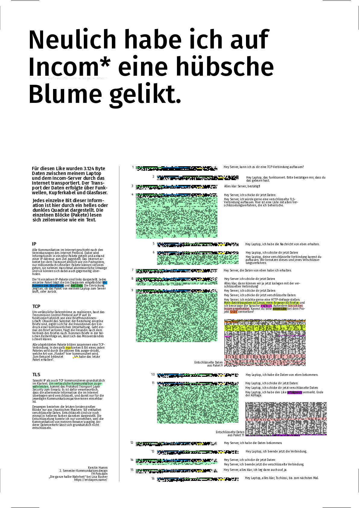

# A single like

Ein Poster, dass den Datenfluss eines einzelnen Likes darstellt.



Die Dateien `plakat_mit_text_final.pdf` und `plakat_ohne_text_final.pdf` (Text als Pfade) bilden die fertige Abgabe.


## Building

Benötigt werden `cargo`, `rustc`, `wireshark` und `inkscape`. [Nix](https://nixos.org/nix)-User können mit `nix-shell` bequem alle Dependencies temporär installieren.

Zum generieren des Plakates dann

```
cargo build
./target/debug/plakat
```

ausführen. Das Ergebnis liegt dann in template.svg (in diesem Fall natürlich ohne die meisten Diagramme, weil die Rohdaten nicht im Repo liegen).
